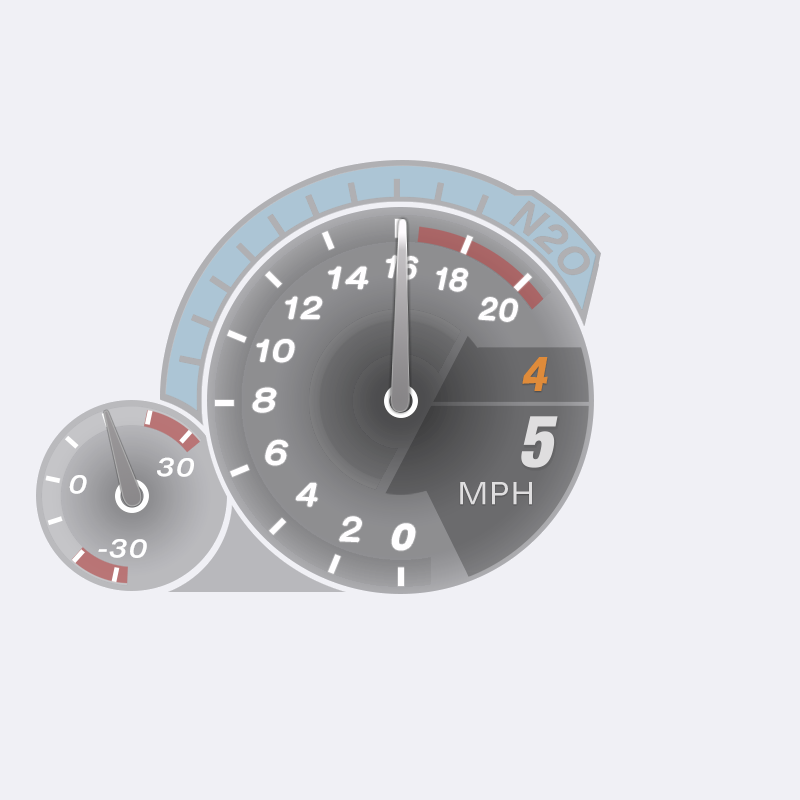

# Forza Horizon 6 Need For Speed Underground 2 Speedometer Mod

Transparent Windows overlay that draws a **pixel-accurate Need for Speed: Underground 2** race cluster on top of **Forza Horizon 6**, driven by official **Data Out** UDP telemetry.

Built from the Assetto Corsa **NFSU2HUD 3.0** art pack (same dials, needles, fonts, and layout as the AC mod).



> Place your own copy of the NFSU2HUD 3.0 `img` folder before running — see [ASSETS.md](ASSETS.md). Textures are **not** redistributed in this repository.

---

## Features

- NFSU2 race tach + boost + N2O cluster (AC NFSU2HUD 3.0 frames)
- Live FH6 Data Out (speed, gear, RPM, boost)
- RPM faces scale with engine redline (cars → bikes up to ~20k)
- Click-through overlay (game keeps mouse/controller focus)
- Move mode: drag to reposition, scroll wheel to resize
- System tray by default (no taskbar clutter)
- mph / kph toggle
- Demo mode until FH6 packets arrive

---

## Requirements

- Windows 10/11
- [.NET 8 Desktop Runtime](https://dotnet.microsoft.com/download/dotnet/8.0) (or use the self-contained Release zip)
- Forza Horizon 6 with **Data Out** enabled
- **NFSU2HUD 3.0** textures (see [ASSETS.md](ASSETS.md))

---

## Quick start (Release build)

1. Download the latest **Release** zip from GitHub Releases.
2. Install NFSU2HUD 3.0 art → copy its `img` folder to `Assets\AcHud` next to the `.exe` (details in [ASSETS.md](ASSETS.md)).
3. In FH6: **Settings → HUD and Gameplay → Data Out**
   - Data Out = **On**
   - IP = `127.0.0.1`
   - Port = `20777`
   - Prefer **borderless** window mode
4. Run `Nfsu2ForzaHud.exe`
5. Look for the tray icon (U2 tach). HUD appears bottom-right.

---

## Hotkeys

| Key | Action |
| --- | --- |
| **F1** | Show / hide HUD (tray) |
| **F2** | Toggle mph / kph |
| **F3** | Toggle demo mode |
| **F4** | Move mode on/off (drag + scroll resize) |
| **F5** | Toggle status / debug bar (hidden by default) |
| **F9** | Quit (works globally) |

**Move mode (F4)**

- Drag anywhere on the HUD to reposition
- Mouse wheel = resize (Shift + wheel = faster)
- Position & size are saved automatically
- Press **F4** again to lock + restore click-through

**Tray**

- Double-click icon → show HUD
- Right-click → Show / Hide / Move / Quit

---

## Build from source

```powershell
cd "path\to\this\repo"
dotnet build -c Release
dotnet run -c Release
```

Publish a folder build:

```powershell
dotnet publish -c Release -r win-x64 --self-contained true `
  -p:PublishSingleFile=true -o .\publish
```

Then copy NFSU2HUD `img` → `publish\Assets\AcHud`.

---

## Project layout

```
├── App.xaml / MainWindow.xaml     Overlay window + tray
├── Hud/                           Asset loader, settings, layout helpers
├── Input/                         Global hotkeys + tray icon
├── Telemetry/                     FH6 UDP packet parse (324-byte Horizon)
├── Assets/                        (you add AcHud/ here — not in git)
├── app.ico                        App / tray icon
└── docs/                          Screenshots & notes
```

---

## Credits

- **NFSU2HUD 3.0** (Assetto Corsa) by [Stormix43](https://www.racedepartment.com/members/stormix43.412027/) — art pack & frame layout this overlay mirrors
- Need for Speed™ Underground 2 — Electronic Arts (visual style reference)
- Forza Horizon™ — Xbox Game Studios / Playground Games (telemetry)

This project is a fan-made overlay. It is **not** affiliated with EA, Xbox, or Playground Games. You must own the games / obtain the AC HUD art yourself.

---

## License

Code in this repository is MIT — see [LICENSE](LICENSE).  
Game art / NFSU2HUD textures remain property of their respective owners and are **not** included.
